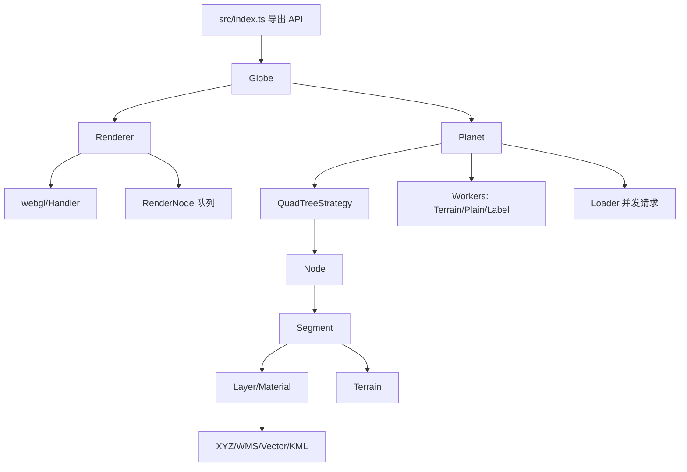

# OpenGlobus LLM 提示词工程文档（面向 `openglobus-master`）

> 文档目标：基于 `openglobus-master` 的真实代码结构，给出一套可直接落地的 LLM 提示词工程方法，用于地图引擎开发、渲染优化与扩展实现。

---

## 1. 项目目录结构解析

### 1.1 顶层目录概览

```text
openglobus-master/
├─ src/                 # 核心源码（引擎、渲染、图层、地形、交互）
├─ sandbox/             # 示例工程（功能验证与演示入口）
├─ tests/               # Vitest/JSDOM 测试用例
├─ lib/                 # 构建产物（ESM + css + res）
├─ res/                 # 默认资源（night/spec 贴图、字体）
├─ css/                 # 样式入口（og.css）
├─ bmfont/              # 字体资源与字形生成脚本
├─ .github/             # CI/CD（lint/build/test/release）
├─ package.json         # 脚本与依赖定义
├─ vite.config.mts      # 构建配置（GLSL、静态资源复制、terser）
├─ tsconfig.json        # TS 声明输出配置（emitDeclarationOnly）
└─ vitest.config.ts     # 测试配置（jsdom + glsl mock）
```

### 1.2 核心模块说明（`src/`）

> 统计口径：`src` 下 `.ts/.js` 文件静态统计，共 248 个文件。

| 模块 | 文件数 | 主要职责 | 代表文件 |
|---|---:|---|---|
| `control/` | 69 | 交互控制器（导航、缩放、图层开关、测量、时间线） | `control/Navigation.ts`, `control/Control.ts` |
| `entity/` | 24 | 实体系统（点/线/面/标签/3D对象） | `entity/Entity.ts`, `entity/EntityCollection.ts` |
| `utils/` | 21 | 通用工具、Worker、纹理与矢量瓦片辅助 | `utils/Loader.ts`, `utils/BaseWorker.ts` |
| `layer/` | 14 | 图层抽象与实现（XYZ/WMS/Vector/KML） | `layer/Layer.ts`, `layer/XYZ.ts`, `layer/Vector.ts` |
| `quadTree/` | 14 | 四叉树分片与 LOD 策略 | `quadTree/QuadTreeStrategy.ts`, `quadTree/Node.ts` |
| `shaders/` | 12+ | 着色器程序与模块化 GLSL | `shaders/drawnode/*`, `shaders/atmos/*` |
| `math/` | 12 | 向量矩阵与几何计算 | `math/Vec3.ts`, `math/Mat4.ts` |
| `webgl/` | 9 | WebGL 封装（Handler/Program/Framebuffer） | `webgl/Handler.ts`, `webgl/Program.ts` |
| `terrain/` | 7 | 地形提供器与高程处理 | `terrain/EmptyTerrain.ts`, `terrain/GlobusTerrain.ts` |
| `scene/` | 6 | 场景节点（Planet/SkyBox/RenderNode） | `scene/Planet.ts`, `scene/RenderNode.ts` |
| 其他 | - | 摄像机、投影、输入、天体计算等 | `camera/PlanetCamera.ts`, `proj/*` |

### 1.3 核心运行链路（启动到渲染）



### 1.4 关键文件功能描述

| 文件 | 功能定位 | 开发关注点 |
|---|---|---|
| `src/index.ts` | SDK 总出口，汇总导出模块与类型 | 对外 API 兼容性、tree-shaking 友好性 |
| `src/Globe.ts` | 高层装配器，串联 `Renderer + Planet + Controls + Layers` | 初始化参数治理、默认控制器策略 |
| `src/renderer/Renderer.ts` | 渲染主循环、FBO、拾取、后处理 | 帧预算、MSAA/ToneMapping、资源生命周期 |
| `src/webgl/Handler.ts` | WebGL 上下文与底层资源管理 | 上下文能力探测、纹理/Program 创建性能 |
| `src/scene/Planet.ts` | 地球场景核心，管理四叉树、地形、图层、事件 | LOD、缓存清理、terrain/layer 锁机制 |
| `src/quadTree/QuadTreeStrategy.ts` | 可视分片收集与完成态判定 | 细节层级切换稳定性、事件触发时机 |
| `src/segment/Segment.ts` | 瓦片分片数据结构（材质/顶点/高程） | CPU/GPU 内存占用、边界拼接 |
| `src/layer/Layer.ts` | 图层基类（可见性、范围、属性、事件） | 扩展层的一致性约束 |
| `src/layer/XYZ.ts` | 影像瓦片图层实现 | URL 模板、并发加载、abort 机制 |
| `src/layer/Vector.ts` | 矢量图层与实体集合管理 | 异步处理、clampToGround、depthOrder |
| `src/terrain/EmptyTerrain.ts` | 地形接口基类 | 自定义地形实现入口 |
| `src/terrain/GlobusTerrain.ts` | 高程下载与解码、缓存 | noData、native zoom、缓存淘汰 |
| `src/utils/Loader.ts` | 请求并发队列与状态分发 | `MAX_REQUESTS` 调优、error/abort 语义 |
| `src/utils/BaseWorker.ts` | Worker 池抽象 | 线程复用、pending queue 管理 |
| `src/camera/PlanetCamera.ts` | 行星相机模型与飞行控制 | 最小/最大高度、碰撞、飞行平滑 |

### 1.5 依赖关系分析

#### 1.5.1 构建与测试依赖

- 构建：Vite + Rollup(Terser) + `vite-plugin-glsl` + 静态资源复制插件。
- 类型：TypeScript 仅输出声明（`emitDeclarationOnly`）。
- 测试：Vitest + JSDOM（并对 `.glsl` 与 `.worker` 做 mock）。
- CI：GitHub Actions 执行 `lint/build/test`，发布流水线会构建 docs 并 npm publish。

#### 1.5.2 运行时依赖形态

- 运行时几乎无外部业务库耦合，核心依赖浏览器原生能力：WebGL、Fetch、Worker、ImageBitmap。
- `src/utils/gltf/gltfParser.ts` 使用 `draco3d`（用于 Draco 压缩网格解码，属于 3D 模型能力链路）。

#### 1.5.3 模块耦合特征（静态导入统计结论）

- 高耦合中心：`control`、`entity`、`layer`。
- 被高频依赖基础模块：`math/Vec3`、`utils/shared`、`Events`、`LonLat`。
- 典型依赖路径：
  - `Globe -> Renderer -> Handler`
  - `Globe -> Planet -> QuadTreeStrategy -> Node -> Segment`
  - `Planet -> Loader + TerrainWorker + PlainSegmentWorker`
  - `Vector -> EntityCollection -> Geometry/Label/Polyline Handler`

#### 1.5.4 需重点关注的依赖风险

1. **入口聚合依赖过重**：`src/index.ts` 统一导出方便使用，但会放大上下文噪声；LLM 生成代码时应优先按模块直接 import。  
2. **交叉引用**：`control/Control.ts` 通过 `../index` 引入 `Planet/Renderer`，存在潜在循环依赖风险。  
3. **多线程 + 资源管理**：Worker 与 Loader 并行策略若处理不当，易导致内存高水位和任务积压。

---

## 2. 提示词设计规范

### 2.1 上下文设定（Context）

建议每次任务都提供以下上下文字段，避免 LLM 产生“泛地图引擎答案”：

```yaml
project: openglobus-master
entry: src/index.ts
runtime: browser-webgl
focus_module: [scene/Planet, renderer/Renderer, layer/Vector]
allowed_paths:
  - src/**
  - tests/**
constraints:
  - keep public api compatible
  - no breaking changes in layer/event semantics
verification:
  - npm run test
  - npm run build
```

### 2.2 指令格式（Instruction Format）

推荐固定 6 段式提示词结构：

```text
[角色]
你是 OpenGlobus 引擎维护工程师。

[目标]
在不破坏现有 API 的前提下，完成 XXX。

[范围]
只允许修改：src/layer/XYZ.ts, src/utils/Loader.ts。

[约束]
1) 保持 Layer/Loader 的事件语义不变
2) 不修改 public 类型名
3) 必须补充测试

[输出]
- 变更摘要
- 关键设计说明
- 代码补丁
- 测试用例

[验收]
- test 全通过
- build 通过
- 说明性能影响
```

### 2.3 参数说明（Prompt 参数化）

| 参数 | 类型 | 是否必填 | 说明 | 示例 |
|---|---|---|---|---|
| `task_type` | enum | 是 | `bugfix`/`feature`/`refactor`/`perf` | `perf` |
| `focus_module` | string[] | 是 | 主分析模块（1~3 个） | `['scene/Planet','quadTree']` |
| `target_files` | string[] | 是 | 允许改动文件 | `['src/scene/Planet.ts']` |
| `forbidden_files` | string[] | 否 | 禁止改动文件 | `['src/index.ts']` |
| `api_stability` | enum | 是 | `strict`/`normal` | `strict` |
| `perf_budget_ms` | number | 否 | 帧耗时预算（例如 16.6ms） | `16.6` |
| `memory_budget_mb` | number | 否 | 内存预算 | `512` |
| `output_style` | enum | 否 | `patch`/`design-doc`/`both` | `both` |
| `validation_cmds` | string[] | 是 | 验证命令 | `['npm run test','npm run build']` |

### 2.4 推荐输出结构（让 LLM 可审查、可回放）

```json
{
  "task": "...",
  "analysis": {
    "root_cause": ["..."],
    "affected_modules": ["..."]
  },
  "changes": [
    {
      "file": "src/...",
      "type": "modify|add|remove",
      "summary": "..."
    }
  ],
  "validation": {
    "commands": ["..."],
    "result": "pass|fail"
  },
  "risk": ["..."],
  "rollback": "..."
}
```

---

## 3. 使用场景示例

### 3.1 地理可视化场景（图层与要素）

**目标**：基于 OpenGlobus 新增一个“底图 + 矢量标注”场景，并保证图层可控。

**示例提示词**：

```text
你是 OpenGlobus 开发助手。
请基于 openglobus-master 的实现方式，创建一个最小示例：
1) 使用 XYZ 作为底图
2) 创建 Vector 图层并添加 1000 个点实体
3) 启用 LayerSwitcher 与 ScaleControl
4) 代码放在 sandbox/layers/custom-layer-demo.js
5) 不能修改 src/index.ts 的对外导出
6) 输出完整代码 + 为什么这样组织图层
```

**预期关注点**：
- `Layer` 生命周期（add/remove/visibility）。
- `Vector` 的 `async`、`depthOrder`、`clampToGround` 参数。
- `Loader` 并发与 `abortLoading` 语义一致性。

---

### 3.2 3D 渲染场景（模型与光照）

**目标**：加载 glTF/GLB 并挂载到实体体系，兼顾 Draco 解码可选路径。

**示例提示词**：

```text
在不破坏现有实体系统的前提下，扩展示例 sandbox/modelLoad：
- 使用 Gltf.loadGlb 加载模型
- 若模型启用 KHR_draco_mesh_compression，给出 connectDracoDecoderModule 的接入代码
- 将模型转换为 Entity 并加入 Vector 图层
- 给出失败降级方案（模型加载失败时保留地球与底图可用）
- 输出：代码 + 错误处理逻辑 + 性能注意事项
```

**预期关注点**：
- `utils/gltf/gltfParser.ts` 的异常语义（未连接 Draco 时会抛错）。
- `Entity` 与 `GeoObject` 渲染路径对接。
- 纹理与模型资源生命周期释放策略。

---

### 3.3 性能优化场景（帧率/内存/请求）

**目标**：优化中高缩放下的卡顿和内存波动。

**示例提示词**：

```text
请对 Planet 渲染路径做性能优化分析，不改公开 API：
1) 分析 _globalPreDraw、memClear、Loader 并发、Worker 队列
2) 给出 maxNodesCount / maxLoadingRequests / vectorTileSize 的调参建议
3) 给出可执行的 profiling 清单（指标、埋点位置、判断阈值）
4) 输出 markdown 报告，并附最小补丁建议
```

**预期关注点**：
- `Planet._maxNodes` 与 `memClear()` 触发条件。
- `Loader.MAX_REQUESTS` 对网络拥塞和主线程解码的影响。
- Worker 数量与设备核数匹配策略（过多并不总是更快）。

---

## 4. 最佳实践建议

### 4.1 错误处理

1. **初始化错误兜底**：`Globe.attachTo` 找不到目标容器时仅 warning，业务层应追加显式失败策略（例如 fallback container）。  
2. **网络错误统一语义**：`Loader` 返回 `ready/error/abort`，提示词里必须要求 LLM 保留这三态。  
3. **图层切换中断**：隐藏图层时及时 `abortLoading`，避免无效请求堆积。  
4. **WebGL 能力分支**：Atmosphere 走 WebGL2 路径，低能力设备需自动降级。  
5. **Worker 清理**：退出/销毁时必须调用 `destroy()`，防止后台线程泄漏。

### 4.2 性能调优

- **先限流再优化算法**：优先从 `maxLoadingRequests`、Worker 数量、图层可见性入手。
- **控制节点上限**：依据场景复杂度调整 `maxNodesCount`，避免触发频繁 `memClear` 抖动。
- **减少不必要重建**：避免在每帧重复创建对象/数组，优先复用缓冲区。
- **分层渲染策略**：合理利用 `depthOrder`、`height`、图层切片逻辑，降低过度绘制。
- **指标先行**：至少监控 FPS、帧耗时、纹理数量、请求队列长度、Worker pending 长度。

### 4.3 扩展开发

- **扩展图层**：继承 `Layer` 或 `XYZ`，保持 `loadMaterial/abortLoading/remove` 契约。
- **扩展地形**：继承 `EmptyTerrain`，实现高程加载、缓存与 `getHeightAsync`。
- **扩展控制器**：继承 `Control`，严格区分 `oninit/onadd/onactivate/onremove` 生命周期。
- **扩展四叉树策略**：继承 `QuadTreeStrategy`，优先复用 `collectRenderNodes` 与完成态事件。
- **测试先行**：为 `.worker` 与 `.glsl` 变更同步添加 mock 与回归测试。

### 4.4 给 LLM 的工程化约束（强烈建议）

```text
- 禁止直接修改 src/index.ts 导出结构，除非需求明确要求。
- 新增类必须补充最小示例（sandbox）和最小测试（tests）。
- 涉及 Loader/Worker/Planet 的改动，必须说明并发与内存影响。
- 涉及 shader 的改动，必须说明 WebGL1/WebGL2 兼容策略。
- 所有输出都要给“回滚方案”。
```

---

## 附录 A：可复用 Prompt 模板（推荐直接复制）

### A.1 架构分析模板

```text
你是 OpenGlobus 架构分析师。
请分析以下模块：{{focus_module}}
目标：{{goal}}
约束：
1) 基于 openglobus-master 实际代码
2) 指出关键依赖、调用路径、潜在风险
3) 给出文件级建议（路径 + 理由）
输出：markdown（含表格、流程图、风险清单）
```

### A.2 代码实现模板

```text
你是 OpenGlobus 核心开发工程师。
任务类型：{{task_type}}
目标文件：{{target_files}}
限制：{{constraints}}
验收命令：{{validation_cmds}}

请输出：
1) 变更方案
2) 代码补丁
3) 测试补丁
4) 风险与回滚
```

### A.3 性能调优模板

```text
你是 OpenGlobus 性能优化工程师。
目标：将 {{scenario}} 的 P95 帧耗时控制在 {{perf_budget_ms}} ms 内。
请结合 Planet/Renderer/Loader/Worker 路径，给出：
- 瓶颈定位步骤
- 可执行调参方案
- 代码级优化点（不改公开 API）
- 指标采集与验收标准
```

---

## 附录 B：实施优先级建议

1. **先做 Prompt 规范化**（统一上下文字段 + 输出契约）。  
2. **再做链路化任务**（分析 -> 实现 -> 验证 -> 回滚）。  
3. **最后做自动化**（将常见 prompt 模板固化到团队脚手架/CI 注释机器人）。

